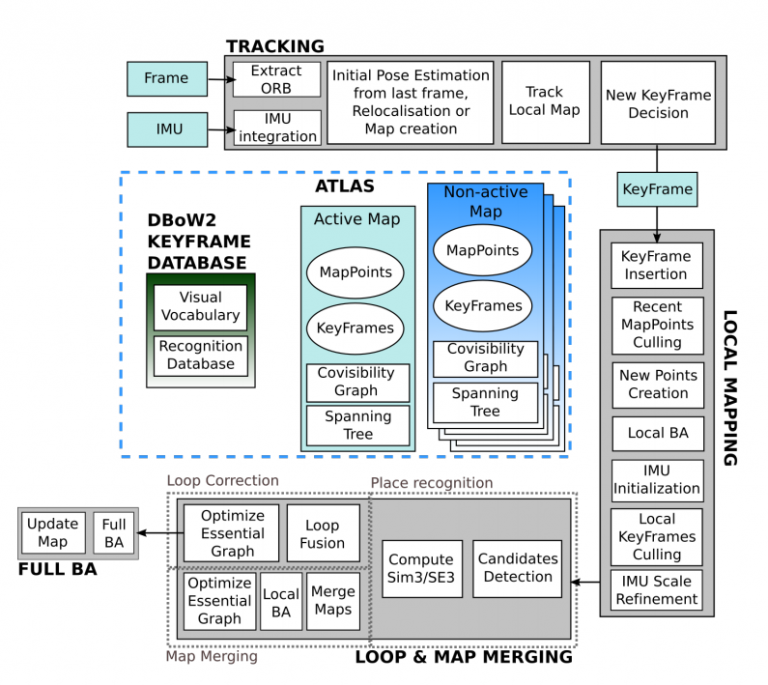

* content
{:toc}

本文主要介绍orb-slam3的整个系统及imu在这个系统中的使用方式

[ORB-SLAM3: An Accurate Open-Source Library for Visual, Visual-Inertial and Multi-Map SLAM](https:\\arxiv.org\abs\2007.11898v1)

## 主要创新点

1.整个系统（包括在imu初始化阶段）采用最大后验概率方法估计相机位姿，相比之前方法鲁棒性和精度都有所提高

2.修改图像召回算法，对于候选帧先进行几何一致性检验，然后再校验局部一致性，尽管计算耗时会略微增加，但提高了图像召回率。

3.增加多地图管理系统（Atlas），特征点跟丢后会创建新的小地图，回环成功后进行地图合并操作.

4.增加鱼眼相机模型，并且容易添加其他相机模型

当然，这篇论文最重要的贡献在于提供了目前为止完整性和精度都比较出色的SLAM系统，最最重要的是代码开源了！！！！

## 系统组成

ORB_SLAM3系统框图

ORB_SLAM3主要由四部分组成，地图集（Atlas）、跟踪线程、局部建图线程、回环检测和地图合并线程

## VI-SLAM

### A.残差定义

状态量定义为

$$
S_i =\begin{bmatrix} \mathbf {T}_i \\
\mathbf {v}_i\\
\mathbf{b}_i^g \\
\mathbf{b}_i^a 
\end{bmatrix}
$$

与VINS类似，通过imu预积分算法计算出视觉i和i+1帧对应的
$$
\begin{bmatrix} {\Delta \mathbf{R}_{i,i+1}} & {\Delta{\mathbf{v}_{i.i+1}}} &  \Delta \mathbf{p}_{i,i+1} \end{bmatrix} 
$$

以此作为观测，定义惯性残差为

$$ 
\begin{aligned}\mathbf{r}_{\Delta \mathbf{R}_{i,i+1}} &= Log ( \Delta \mathbf{R}_{i,i+1}^T \mathbf{R}_i^T \mathbf{R}_{i+1}) \\

\mathbf{r}_{\Delta \mathbf{v}_{i,i+1}} &= \mathbf{R}_i^T(\mathbf{v}_{i,i+1}-\mathbf{v}_i-\mathbf{g} \Delta t_{i,i+1})-\Delta\mathbf{v}_{i,i+1}\\

\mathbf{r}_{\Delta\mathbf{p}_{i,i+1}}&=\mathbf{R}_i^T(\mathbf{p}_j-\mathbf{p}_i-\mathbf{v}_i\Delta t-\frac 1 2 \mathbf{g}\Delta t^2)-\Delta \mathbf{p}_{i,i+1} 
\end{aligned} $$

视觉作为观测。定义重投影误差为

$$
\small \mathbf{r}_{ij}=\mathbf{u}_{ij}-\mathbf{\pi}(\mathbf{T_{CB} \mathbf{T}_i^{-1}\oplus\mathbf{x}_j})
$$

### B.imu初始化

imu初始化

imu初始化分为三个阶段：

Vision-only MAP Estimator, 纯视觉SLAM，耗时2秒，关键帧插入频率为4Hz，这一阶段主要估计出关键帧的位置和姿态

Inertial-only MAP Estimator,上一阶段计算出的位姿结合帧间的惯性测量，估计出视觉SLAM阶段的尺度，重力的方向，加计和陀螺的零偏以及速度。定义的代价函数为

$$
\small y_k^*= arg\min \left( \lVert \mathbf{r}_p \rVert_{\sum_p}^2+\sum_{i=1}^k \lVert \mathbf{r}_{\mathbf{I}_{i-1,i}}\rVert_{\sum_{\mathbf{I}_{i-1,i}}}^2 \right)
$$

式中,$\mathbf{r}_p$为先验残差。

Visual-Inertial MAP Estimation,这一阶段主要是对上述两个阶段优化出的参数进行refine。目的是得到精度更高的结果。

### C.跟踪和建图

1、优化最新两帧的状态，地图点保持固定；

2、优化滑窗里的关键帧和特征点，共视帧作为观测也加入到优化中，但共视帧的特征点和状态保持固定；

3、当初始化阶段imu的激励不够时，只优化尺度和重力方向，然后估计每帧imu的bias，这个trick使得计算快而有效。

### D.Robustness to tracking loss

1、短时丢失，通过imu计算当前帧的状态，使用更大的滑窗进行优化

2、长时丢失，建立新的地图，并把它设为激活状态

## 地图合并和回环

如果召回的关键帧在当前激活的地图中发生则进行回环优化的操作，如果在其他地图中，则激活该地图并进行merge操作。当估计出新的关键帧和地图的相对pose后，召回的关键帧及其共视帧形成一个局部窗口进一步进行优化，得到更精确的结果

## 总结

地图合并操作比较复杂，这里不再进行赘述，后续代码阅读会这部分进行详细总结，以上内容纯属个人理解，如有错误欢迎指出.